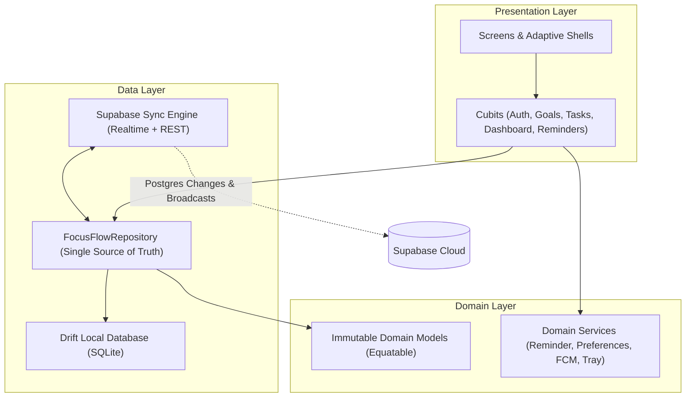

<p align="center">
  
</p>

<h1 align="center">FocusFlow</h1>

<p align="center">
  <strong>Stop juggling chaotic to-do lists. Connect your daily tasks directly to what truly matters.</strong>
</p>

<p align="center">
  FocusFlow is a modern, cross-platform productivity workspace built with Flutter. It blends goal-oriented task planning, an offline-first SQLite core, intelligent multi-layered reminders, and real-time cloud synchronization into one fluid experience.
</p>

<p align="center">
  <a href="#-key-features"></a>
  <a href="#-tech-stack"></a>
  <a href="#-offline-first--cloud-sync"></a>
  <a href="LICENSE"></a>
</p>

---

## 💡 The Story: Why FocusFlow?

Most to-do apps suffer from one of two extremes:
1. **The Endless Chore List:** You write down 20 errands without context, feel overwhelmed, and lose sight of your broader ambitions.
2. **The Clunky Enterprise Tracker:** Heavy corporate tools that require 15 clicks just to log a single thought.

**FocusFlow was built to bridge this gap.** 

Instead of isolating tasks as endless checklists, FocusFlow anchors every single task to a **Goal**. When your daily tasks serve an overarching objective—whether it’s launching a side project, studying for an exam, or getting fit—focus shifts from *busywork* to *genuine progress*. 

And because real life happens everywhere—on a spotty subway commute or at your desktop workstation—FocusFlow operates **100% offline-first**, silently syncing across all your devices the moment connectivity returns.

---

## ✨ Key Features

### 🎯 1. Goal-Driven Productivity Hierarchy
* **Purpose-First Planning:** Every task lives inside a parent goal. No more aimless checkboxes.
* **Smart Progress Computation:** Watch your goal progress bar climb automatically in real-time as tasks transition from `Not Yet` ➔ `In Progress` ➔ `Done`.
* **Custom Categories & Badges:** Categorize objectives with bespoke colors and icons (Work, Study, Fitness, Personal, or define your own).

### 🔔 2. Multi-Tier Intelligent Reminders
Never miss a beat, whether your phone screen is off or you're deep in desktop coding:
* **Background & Scheduled Alarms:** Powered by Android `WorkManager` and timezone-aware local notifications that survive app kills.
* **Server-Side Push via Supabase & FCM:** Automated Edge Functions trigger Cloud Messaging whenever a reminder window opens.
* **Cross-Device Dismissal Sync:** Dismiss a reminder on your desktop, and it automatically silences across your mobile devices via real-time broadcasts.
* **Do Not Disturb (DND):** Set custom quiet hours (including overnight schedules) so your sleep and deep-work sessions remain sacred.
* **Custom Soundscapes:** Choose your favorite chime or upload a custom alert sound.

### ⚡ 3. Offline-First with Seamless Cloud Sync
* **Zero Waiting:** Powered locally by **Drift (reactive SQLite)**. The UI reacts instantly to every click, tap, and toggle.
* **Automated Sync Engine:** A dedicated sync engine performs debounced pushes and background delta-pulls with Supabase, handling conflict resolution and soft deletions gracefully.
* **Frictionless Guest Mode:** Jump straight into the app without making an account. When you're ready, sign in and your local data automatically uploads to the cloud.

### 🖥️ 4. Native Desktop Polish (Windows)
* **System Tray Integration:** Minimize FocusFlow straight to the Windows tray to keep your taskbar clean while background timers keep ticking.
* **Auto-Start on Boot:** Optionally launch silently in the background on startup (`--silent` / `--minimized`).
* **Adaptive Responsive Shell:** Seamlessly morphs between a Mobile Bottom Navigation bar, a Tablet NavigationRail, and an expansive 256px Desktop Sidebar with overdue task counters and profile controls.

### 🎨 5. The "Network Flow" Design System
Built from the ground up on a custom design system documented in `DESIGN.md`:
* **Crisp Aesthetic:** A clinical, distraction-free light palette accented with high-contrast *Connectivity Blue* (`#005691`), *Electric Green*, and *Warm Orange*.
* **Typographic Harmony:** High-legibility **Open Sans** paired with technical **Space Grotesk** headlines.
* **16 Reusable Atomic Components:** Custom badges, metric tiles, progress tracks, choice palettes, and empty-state illustrations.

---

## 🏛️ Architecture & Engineering

FocusFlow is structured using **Feature-First Clean Architecture** with **BLoC/Cubit** for predictable, testable, and reactive state flow.



### Architectural Highlights
- **In-Memory Snapshot (SSOT):** The repository maintains a single in-memory reactive snapshot emitted via broadcast streams, eliminating flickering and duplicate queries.
- **Soft Deletes Everywhere:** Entities utilize `deletedAt` timestamps, ensuring flawless two-way synchronization across multiple devices without orphaned records.
- **Scoping & Security:** Multi-tenant architecture with Supabase Row Level Security (RLS) guaranteeing strict isolation between user accounts and guest sessions.

---

## 🛠️ Tech Stack

| Category | Technology | Description |
| :--- | :--- | :--- |
| **Framework** | [Flutter](https://flutter.dev) (SDK `^3.11.0`) | Multi-platform UI toolkit |
| **State Management** | [flutter_bloc](https://pub.dev/packages/flutter_bloc) / Cubit | Predictable state container |
| **Routing** | [go_router](https://pub.dev/packages/go_router) | Declarative navigation with auth guards |
| **Local Database** | [Drift](https://drift.simonbinder.eu/) + SQLite | High-performance reactive persistence |
| **Backend & Auth** | [Supabase](https://supabase.com/) | PostgreSQL, Auth, Realtime channels, Storage |
| **Push Notifications** | [Firebase Cloud Messaging (FCM)](https://firebase.google.com/docs/cloud-messaging) | Server-driven mobile push alerts |
| **Background Work** | [WorkManager](https://pub.dev/packages/workmanager) | Periodic Android background scheduling |
| **Desktop Integrations** | `tray_manager`, `window_manager`, `local_notifier` | System tray & native Windows notifications |
| **Analytics & Visuals**| [fl_chart](https://pub.dev/packages/fl_chart) | Responsive dashboard charts |
| **Edge Functions** | Deno / TypeScript | Serverless cron worker for reminder triggers |

---

## 📂 Project Structure

```text
lib/
├── app/
│   ├── router/            # GoRouter configuration & route guards
│   ├── theme/             # Design tokens, color palette, typography & ThemeData
│   └── focus_flow_app.dart # Root widget & MultiBloc/Repository providers
├── core/
│   ├── data/
│   │   ├── local/         # Drift database schema, tables & migrations (v1-v5)
│   │   ├── remote/        # Supabase Sync Engine (Realtime + Broadcast)
│   │   └── focus_flow_repository.dart # Core repository implementation
│   └── domain/
│       ├── focus_flow_models.dart      # Immutable domain entities
│       └── services/      # ReminderService, PreferencesService, FcmService, TrayService
├── features/
│   ├── auth/              # Sign In, Sign Up, Password Reset, Guest Mode
│   ├── dashboard/         # Productivity streaks, completion stats, charts
│   ├── goals/             # Goal CRUD, type palettes, progress calculation
│   ├── tasks/             # Task CRUD, lifecycle transitions (NotYet/InProgress/Done)
│   ├── reminders/         # Multi-device notification engine & DND checks
│   ├── profile/           # User profile & avatar management
│   └── settings/          # DND hours, sound preferences, startup behaviors
└── shared/
    └── presentation/      # Adaptive shell (Mobile/Tablet/Desktop) & 16 design widgets
```

---

## 🚀 Getting Started

Follow these steps to run FocusFlow locally on your development machine.

### Prerequisites
- [Flutter SDK](https://docs.flutter.dev/get-started/install) (`>= 3.11.0`)
- [Dart SDK](https://dart.dev/get-dart)
- For Android: Android Studio & Android SDK
- For Windows: Visual Studio (with Desktop development with C++)

### 1. Clone the Repository
```bash
git clone https://github.com/Fahd74/FocusFlow.git
cd FocusFlow
```

### 2. Configure Environment Variables
Create a `.env` file in the root directory:
```env
SUPABASE_URL=your_supabase_project_url
SUPABASE_ANON_KEY=your_supabase_anon_public_key
```

*(Optional: Set up Supabase tables using the provided [`supabase_schema.sql`](supabase_schema.sql) file).*

### 3. Install Dependencies & Generate Code
```bash
flutter pub get
dart run build_runner build --delete-conflicting-outputs
```

### 4. Run the App

* **Run on Android:**
  ```bash
  flutter run -d android
  ```

* **Run on Windows Desktop:**
  ```bash
  flutter run -d windows
  ```

* **Run on Web:**
  ```bash
  flutter run -d chrome
  ```

---

## 🧪 Running Tests

FocusFlow includes unit, widget, and integration tests to ensure data integrity and sync stability:

```bash
# Run all unit and widget tests
flutter test

# Run code analysis and linter
flutter analyze
```

---

## 🗺️ Roadmap & Future Enhancements

- [ ] **AI-Powered Task Breakdown:** Decompose complex goals into bite-sized actionable tasks using LLM integration.
- [ ] **Pomodoro & Focus Timer Mode:** In-app ambient audio generator with Pomodoro session tracking.
- [ ] **macOS & iOS Support:** Full Apple ecosystem rollout with APNs and macOS menu bar support.
- [ ] **Collaborative Shared Goals:** Invite friends or colleagues to collaborate on shared projects.

---

## 🤝 Contributing

Contributions make the open-source community an incredible place to learn, inspire, and create. Any contributions you make are **greatly appreciated**!

1. Fork the Project
2. Create your Feature Branch (`git checkout -b feature/AmazingFeature`)
3. Commit your Changes (`git commit -m 'Add some AmazingFeature'`)
4. Push to the Branch (`git push origin feature/AmazingFeature`)
5. Open a Pull Request

---

## 📄 License

Distributed under the MIT License. See `LICENSE` for more information.

<p align="center">
  Built with ❤️ for focused minds everywhere.
</p>
